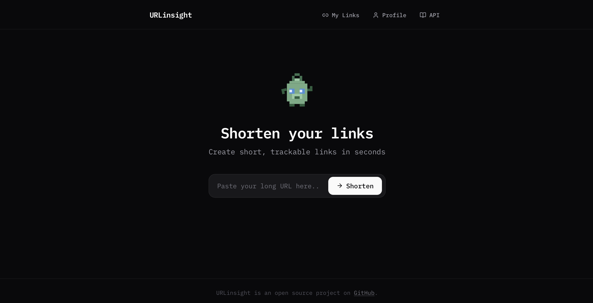
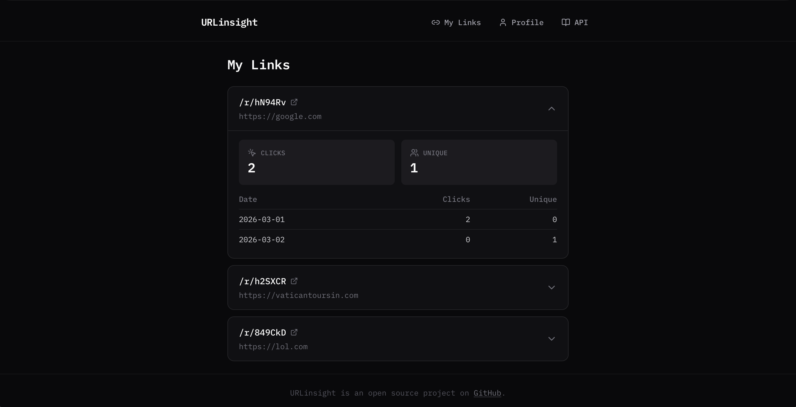

# URLinsight

A self-hosted URL shortener with built-in analytics, user accounts, and a modern frontend. Shorten links, track clicks, and monitor unique visitors - all from a clean, dark-themed interface.

---



## Features

- **URL shortening** with unique 6-character codes
- **Click analytics** - total clicks, unique visitors, and daily breakdowns
- **User accounts** - register, log in, change password
- **Per-user link management** - authenticated users can view and manage their links
- **Anonymous shortening** - create links without an account
- **Privacy-preserving tracking** - visitor IPs are hashed with HMAC-SHA256, never stored raw
- **Rate limiting** via Redis (sliding window, per-IP)
- **Animated pixel-art mascot** with mouse-tracking eyes
- **API documentation page** built into the frontend
- **Responsive dark UI** built with Svelte 5, Tailwind CSS, and IBM Plex Mono



## How It Works

1. **Shorten** - paste a URL, get a short code back
2. **Redirect** - visiting `/redirect/{short_code}` resolves to the original URL
3. **Track** - each redirect records a click event (timestamp, hashed IP, user agent, referrer) and a unique visit
4. **Analyze** - view aggregated totals and daily time-series data per link

If you're logged in, links are saved to your account and visible on the **My Links** page. Anonymous links still work but aren't tied to any profile.

## Tech Stack

| Layer | Technology |
|-------|-----------|
| Backend | Python 3.10+, FastAPI, SQLAlchemy, Pydantic v2 |
| Frontend | Svelte 5, SvelteKit, Tailwind CSS v4, TypeScript |
| Auth | JWT (PyJWT) + bcrypt password hashing |
| Database | SQLite (swappable for PostgreSQL) |
| Rate limiting | Redis |
| Linting | Ruff (Python), ESLint + Prettier (frontend) |
| CI | GitHub Actions |

## Project Structure

```
urlinsight/
├── api/                          # FastAPI backend
│   ├── app/
│   │   ├── main.py               # App entry, CORS, migrations
│   │   ├── api/
│   │   │   ├── deps.py           # Auth & link dependencies
│   │   │   └── routers/
│   │   │       ├── auth.py       # Register, login, me, password
│   │   │       ├── links.py      # Create, list, get, analytics
│   │   │       └── redirect.py   # Redirect + event tracking
│   │   ├── core/
│   │   │   ├── auth.py           # JWT & password utilities
│   │   │   ├── config.py         # Env-based settings
│   │   │   └── security.py       # IP hashing (HMAC-SHA256)
│   │   ├── db/
│   │   │   ├── database.py       # SQLAlchemy engine & session
│   │   │   └── models.py         # User, Link, ClickEvent, UniqueVisit
│   │   ├── middleware/
│   │   │   └── rate_limiter.py   # Redis sliding window limiter
│   │   ├── schemas/
│   │   │   ├── auth.py           # UserCreate, TokenResponse, etc.
│   │   │   └── link.py           # LinkCreate, LinkResponse
│   │   └── services/
│   │       ├── click_events/     # Click event queries
│   │       ├── links/            # Link CRUD, analytics, normalizers
│   │       ├── unique_visits/    # Daily unique visitor tracking
│   │       └── users/            # User creation & lookup
│   ├── tests/                    # 73 tests (pytest)
│   └── pyproject.toml
│
├── web/                          # SvelteKit frontend
│   ├── src/
│   │   ├── app.html              # Shell template (IBM Plex Mono, favicon)
│   │   ├── routes/
│   │   │   ├── +page.svelte      # Home - URL shortener
│   │   │   ├── +layout.svelte    # Root layout + footer
│   │   │   ├── login/            # Login page
│   │   │   ├── register/         # Registration page
│   │   │   ├── links/            # My Links dashboard
│   │   │   ├── profile/          # Account settings & password
│   │   │   └── docs/             # API documentation
│   │   └── lib/
│   │       ├── api.ts            # API client
│   │       ├── auth.svelte.ts    # Auth store (Svelte 5 runes)
│   │       ├── types.ts          # TypeScript interfaces
│   │       └── components/       # Header, Mascot, UrlShortener, etc.
│   ├── static/                   # Favicon, robots.txt
│   └── vite.config.ts            # Dev proxy: /api → :8000
│
├── package.json                  # Monorepo dev scripts
└── .github/workflows/ci.yml     # Lint CI
```


## Auth

| Method | Path | Auth | Description |
|--------|------|------|-------------|
| POST   | /auth/register | -        | Create an account |
| POST   | /auth/login    | -        | Get a JWT access token |
| GET    | /auth/me       | Required | Get current user |
| PUT    | /auth/password | Required | Change password |

## Links

| Method | Path                           | Auth     | Description |
|--------|--------------------------------|----------|-------------|
| POST   | /links                         | Optional | Shorten a URL |
| GET    | /links                         | Required | List your links |
| GET    | /links/{short_code}            | -        | Get link details |
| GET    | /links/{short_code}/analytics  | -        | Get click & visitor analytics |

## Redirect

| Method | Path                        | Description |
|--------|-----------------------------|-------------|
| GET    | /redirect/{short_code}      | Redirect to target URL (records click + unique visit) |

## Setup

### Prerequisites

- Python 3.10+
- Node.js 18+
- Redis (for rate limiting)

### Install

```bash
# Clone the repo
git clone https://github.com/dev-stan/urlinsight.git
cd urlinsight

# Create Python virtual environment
python -m venv .venv
source .venv/bin/activate

# Install backend dependencies
pip install -e "api[dev]"

# Install frontend dependencies
npm install
npm install --prefix web
```

### Configure

Create a `.env` file in the project root:

```
DATABASE_URL=sqlite:///./app.db
IP_HASH_SECRET=your-random-secret-here
JWT_SECRET=your-jwt-secret-here
```

### Run

```bash
# Start both backend and frontend
npm run dev

# Or run separately:
npm run dev:api     # Backend on :8000
npm run dev:web     # Frontend on :5173
```

The frontend proxies `/api/*` requests to the backend during development.

## Testing

```bash
# Run all backend tests
PYTHONPATH=api python -m pytest api/tests/ -q

# Lint
ruff check api/
ruff format --check api/
```